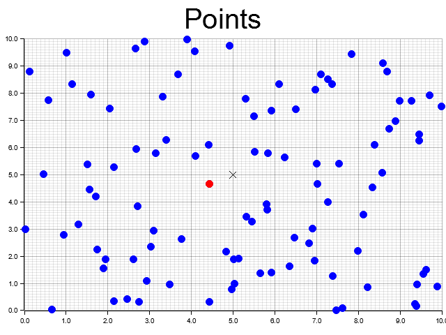

# Vector-Database-Data-Processing

A **vector database** is a type of database that is optimized for storing and querying data with spatial characteristics, such as geographical data or 3D modeling data. Unlike traditional relational databases, vector databases can efficiently handle operations like nearest neighbor search, range search, and spatial join, which are common in spatial data processing.

## Benefits of Using a Vector Database

1. **Efficient Spatial Queries**: Vector databases are designed to handle spatial queries efficiently. They often use spatial indexes like R-trees or Kd-trees to speed up queries like nearest neighbor search or range search.

2. **Support for Complex Spatial Data**: Vector databases can store and manipulate complex spatial data like points, lines, polygons, and multi-polygons. This makes them suitable for applications like GIS, computer graphics, and 3D modeling.

3. **Scalability**: Many vector databases are designed to be scalable and can handle large amounts of spatial data.

## Vector Databases in Rust

Rust is a systems programming language that is known for its performance and safety. While Rust's ecosystem for spatial data processing is not as mature as other languages like Python or JavaScript, there are several crates available for working with spatial data:

- `geo`: Provides types and operations for working with geometric primitives like points, lines, and polygons.

- `kdtree`: Provides a KdTree implementation for efficient nearest neighbor search.

- `rstar`: Provides an R-tree implementation for efficient range search and nearest neighbor search.

In our project, we use these crates to create a vector database, perform nearest neighbor search, and visualize the points in a 2D plot. We also use the `plotters` crate for data visualization.

## Getting Started

To run this project, you need to have Rust installed on your machine. If you don't have Rust installed, you can download it from the [official website](https://www.rust-lang.org/tools/install).

Once you have Rust installed, you can clone this repository and run the project using the following commands:

```sh
git clone https://github.com/yourusername/Vector-Database-Data-Processing.git
cd Vector-Database-Data-Processing
cargo run
```

This will run the `main.rs` file in the `src` directory, which creates a vector database, adds some random points to it, performs a nearest neighbor search to the specified point (Currently (5,5)), and visualizes the points in a 2D plot.



The point that the search is originated from is marked with an 'X' and the nearest neighbor is marked with a red dot. It does so efficiently using the `geo`, `kdtree`, `rstar`, and `plotters` crates. You can modify the code to add your own points and perform different spatial queries.